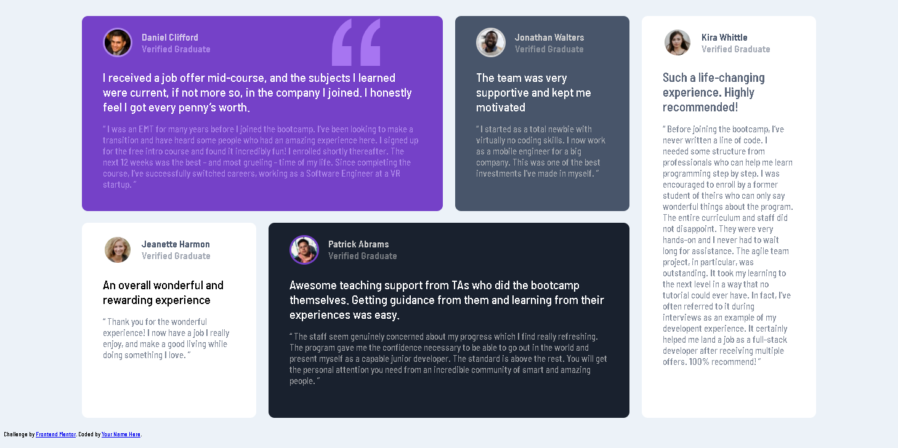

# Frontend Mentor - Testimonials grid section solution

This is a solution to the [Testimonials grid section challenge on Frontend Mentor](https://www.frontendmentor.io/challenges/testimonials-grid-section-Nnw6J7Un7). Frontend Mentor challenges help you improve your coding skills by building realistic projects. 

## Table of contents

- [Overview](#overview)
  - [The challenge](#the-challenge)
  - [Screenshot](#screenshot)
  - [Links](#links)
- [My process](#my-process)
  - [Built with](#built-with)
  - [Useful resources](#useful-resources)
- [Author](#author)

**Note: Delete this note and update the table of contents based on what sections you keep.**

## Overview

### The challenge

Users should be able to:

- View the optimal layout for the site depending on their device's screen size

### Screenshot

### Links

- Solution URL: [Github Solution](https://github.com/darkmagic2/Testimonial-blog-posts)
- Live Site URL: [Live URL](https://your-live-site-url.com)

## My process

### Built with

- Semantic HTML5 markup
- CSS custom properties
- CSS Grid

### Useful resources

- [CSS Tricks](https://css-tricks.com/) - always useful.
- [W3 Schools](https://www.w3schools.com/default.asp) - useful.

## Author

- Website - [Marco](https://github.com/darkmagic2)
- Frontend Mentor - [@darkmagic2](https://www.frontendmentor.io/profile/darkmagic2)
